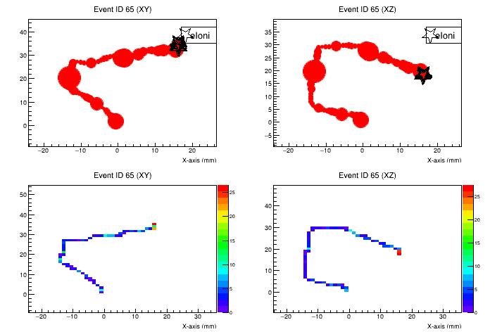
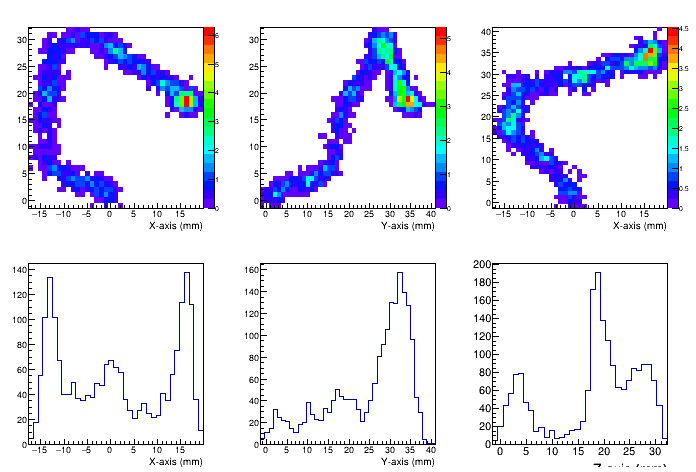

### Exercise 1. Accessing the gas properties through TRestDetectorGas

In REST-for-Physics we use the Garfield++ interface to Magboltz to generate Magboltz gas files and load the gas properties, such as the electron drift velocity or the electron diffusion coefficients. The gas files are produced by Magboltz through MonteCarlo, which is a computationally expensive operation.

We can use [TRestDetectorGas](https://sultan.unizar.es/rest/classTRestDetectorGas.html) to create a gas definition through a metadata description and generate the gas files for given gas mixtures and conditions that can be recovered afterwards without having to perform again the calculation.

You may use `TRestDetectorGas` with any definition using the gas components supported by Magboltz. We have generated a database with pregenerated gas files using the `TRestDetectorGas` interface. You may download the `gases.rml` definition where all the existing pre-generated gas mixtures can be found.

```
wget https://sultan.unizar.es/gasFiles/gases.rml
```

Then, we just print on screen the first line of `TRestDetectorGas` definitions to quickly inspect the available definitions.

```
cat gases.rml | grep "<TRestDetectorGas"
```

which will print on screen all the lines inside the file that contain `<TRestDetectorGas`.

We may chose now the name of any of those gases and load it in our `restRoot` environment.

```
restRoot
root [0] TRestDetectorGas gas("server", "Xenon-TMA 1.5Pct 10-10E3Vcm");
```

This time, instead of proving a local RML file to the `TRestMetadata` constructor we have provided the `server` keyword that will internally retrieve the `gases.rml` file from the database.

We can now print out some of the properties from our gas, including the definitions used to generate the gas.

```
gas.PrintMetadata()
```

before retrieving the gas properties we need to define an electric field, you may try to retrieve the drift velocity without doing it.

```
gas.GetDriftVelocity()
```

A warning will appear on screen indicating that you must first define the value of the electric field. We may define the value using the `SetElectricField` method. Remember that if no units are provided, the default units will be assumed. In this particular case, the relevant default units are `V` and `mm`. Thus, if we do not indicate the units, `V/mm` will be assumed.

```
gas.SetElectricField(100)
gas.GetElectricField()
gas.SetElectricField( 1. / units("kV/cm") );
gas.GetElectricField()
```

Therefore, both returned values from `GetElectricField` method should be the same, the value is always returned in the default units `V/mm`.

We may now retrieve the physical properties from the gas we loaded, such as the electron drift velocity which will be returned in the default REST-for-Physics units also `mm/us`,

```
gas.GetDriftVelocity()
```

or the transversal and longitudinal diffusion coefficients that will be returned in `cm^1/2`.

```
gas.GetTransversalDiffusion()
gas.GetLongitudinalDiffusion()
```

This time the returned value is not given in the default units, there are some exceptions that will be always indicated in the [method documentation](https://sultan.unizar.es/rest/classTRestDetectorGas.html#afdede862e3382b8bc6dacb139d828938).


#### Exercise 1.1. Comparing two gas curves.

We can prepare a small macro to compare two gas curves. We will give the commands in a ROOT interactive shell, but probably it is interesting to create a macro and execute it.


First we will load two different gas definitions:

```
TRestDetectorGas gas1("server", "Neon-Isobutane 1Pct 10-10E3Vcm");
TRestDetectorGas gas2("server", "Neon-Isobutane 3Pct 10-10E3Vcm" );
```

Then we will create some nodes of electric field where we will evaluate the gas drift velocity. We define the variables where we will place these values:

```
Int_t nPoints = 100; 
Double_t eMin = 100;
Double_t eMax = 500;
vector<Double_t> eField(nPoints), vDrift1(nPoints), vDrift2(nPoints);
```

We then define the electric field values manually and retrieve the corresponding drift velocity at each gas mixture and electric field.

```
for (int i = 0; i < nPoints; i++) { 
    eField[i] = eMin + (double)i * (eMax - eMin) / nPoints;  
    gas1.SetElectricField(eField[i] / units("V/cm")); 
    vDrift1[i] = gas1.GetDriftVelocity(); 
    gas2.SetElectricField(eField[i] / units("V/cm")); 
    vDrift2[i] = gas2.GetDriftVelocity(); 
}
```

We can then create a canvas, and two graphs with the datasets we just generated:

```
TCanvas c("Drift velocity", "");
TGraph graph1(nPoints, &eField[0], &vDrift1[0]);
TGraph graph2(nPoints, &eField[0], &vDrift2[0]);

graph1.SetTitle("Drift velocities");
graph1.GetXaxis()->SetTitle("E [V/cm]");
graph1.GetYaxis()->SetTitle("Drift velocity [mm/us]");
graph1.GetYaxis()->SetRangeUser(15,28);
graph1.SetLineColor(kRed);
graph1.SetLineWidth(3);
graph2.SetLineColor(kBlack);
graph2.SetLineWidth(3);
graph1.Draw("ALP");
graph2.Draw("same");
c.Print("DriftVelocities.png");
```

<p align="center"> </p>

### Exercise 2. Generating a detector readout using a TRestDetectorReadout

A readout can be included inside a processing chain, and it serves to find the relation between the electronic channels of the detector and the physical readout channels, as well as to define the topology of the readout. Typical processes that use the readout are `TRestDetectorHitsToSignalProcess` and `TRestDetectorSignalToHitsProcess` for event reconstruction, or `TRestDetectorElectronDiffusion` for diffusing the the charge produced by a Geant4 simulation.

In this exercise we will use the pixel detector readout that can be found at the [basic-readouts](https://github.com/rest-for-physics/basic-readouts) repository (we highly encourage to look on that repository to get further insights related to the readout generation and usage).

We have copied the file `pixelReadouts.rml` into this repository (named here as `readouts.rml`) so that it is more accessible. We will just need to update it so that it covers the proper detector area that we will use in the next exercise. In the next exercise we define a box centered in the `(0,0,0)` with a total drift distance of 1-m defined in the Z-axis, and a total active area of 0.5x0.5-m2. 

Thus, in our readout we will need to adapt the readout area by updating the number of pixels and the size per pixel. We will also define a unique readout plane that will be placed at `(0,0,-500)`.

Follow the following steps to update your readout:
1. Update the `position` in the remaining readout plane to `(0,0,-500)mm`.
2. Update the `cathodePosition` to `(0,0,500)mm`.
3. Update the default value of the pixel pitch and pixel size so that it covers by default an area of 0.5x0.5-m2. For example redefining the pitch to 5cm `<variable name="PITCH" value="50" />` and `<variable name="N_CHANNELS" value="100" />`.

Once this is done just launch the readout generation:

```
restRoot
TRestDetectorReadout readout("readouts.rml");
TFile *f = TFile::Open("readouts.root", "RECREATE" );
readout.Write("pixel");
f->Close();
.q
``` 

**NOTE:** We are pre-generating the readout metadata for the same reason we pre-generated gas files, the readout generation is computationally expensive, and the optimization of the readout is necessary for complex irregular readouts that need to generate a regular mapping that is associated with arbitrary pixel positions and sizes. The regular mapping is then used to fasten the localization of the pixel.

We may test now our readout to check that it is as we expected:

```
restRoot
TFile *f = TFile::Open("readouts.root");
auto readout = f->Get<TRestDetectorReadout>("pixel");
readout->PrintMetadata();
readout->GetNumberOfChannels()
```

And test some of the methods implemented inside the readout, such as retrieving the X and Y positions of a given, `planeId=0`, `moduleId=0` and `channelId=2250`.

```
Double_t x = readout->GetX(0, 0, 2250); 
Double_t y = readout->GetY(0, 0, 2250); 
```

or recover the corresponding daq channel id corresponding to a given `(x,y)` coordinates.

```
Int_t planeId = -1;
Int_t moduleId = -1;
Int_t channelId = -1;

Int_t daqId = readout->GetHitsDaqChannel(TVector3(50, 70, 12.5), planeId, moduleId, channelId);
std::cout << "DAQ id: " << daqId << std::endl;
std::cout << "Plane id: " << planeId << " module id: " << moduleId << " channelId: " << channelId << std::endl;
```

**NOTE:** The channel id returned is the value corresponding to the daq channel id that is associated with the electronics acquisition system. If no decoding file was provided, then the physical readout channel number will be equal to the daq channel id.


### Exercise 3. Diffusing and smearing of punctual detector energy deposits

For testing some of the processes present at the detector library we will generate a dummy Geant4 Monte Carlo simulation where we have a simple gas box filled with gas at high pressure.

We will use the geometry defined at the `geometry.gdml` file, and the simulation conditions described inside `electrons.rml`. The geometry defines a variable `GDML_PRESSURE` that allows us to play externally with the pressure/density of the gas, and we need to define before executing the example. On top of that we will need to create a directory where the output files will be generated.

```
mkdir data
export GDML_PRESSURE=10
restG4 electrons.rml
```

Once we have generated a first MonteCarlo file we will process it with the file `response.rml`. The `response.rml` file defines 4 processes:

1. **g4Ana ([Geant4Analysis](https://sultan.unizar.es/rest/classTRestGeant4AnalysisProcess.html)):** It extracts some relevant information from the Geant4 event (or MonteCarlo truth).
2. **toHits ([Geant4ToDetectorHits](https://sultan.unizar.es/rest/classTRestGeant4ToDetectorHitsProcess.html)):** It transforms the Geant4 event type into a Detector hits event type. We loss particle name and geometry information.
3. **eDiff (DetectorElectronDiffusion):** It implements the effect of charge diffusion on the gas.
4. **smear (DetectorHitsSmearing):** It introduces the effect of the energy resolution of the detector.
5. **hitsAna** (DetectorHitsAnalysis): It adds the energy observable to the analysis tree after the hits have been smeared.

We will execute the process file `response.rml` using as input the `restG4` generated file, which should be something such as `Run01058_Electron_School.root`.

The example `response.rml` is not complete, when you execute it you will get some warning or error messages. Try executing now:

```
restManager --c response.rml --f data/Run01058_Electron_School.root
```

The error message tells you that the electron diffusion process is missing some parameters which are required. Those parameters can be initialized using the `TRestDetectorGas`. Thus, we can solve the error by adding a `TRestDetectorGas` definition. You may use any gas mixture you wish, for example:

```
<TRestDetectorGas name="Neon-Isobutane 2Pct 10-10E3Vcm" pressure="1" file="server" />
```

Once you add the gas defintion, executing again the `response.rml`,

```
restManager --c response.rml --f data/Run01058_Electron_School.root
```

will lead to a different error. This time the gas is defined but the electron diffusion process does not know which electric field should use to obtain the gas properties. We need to define the electric field and the pressure inside the `TRestDetectorElectronDiffusionProcess`.

```
<parameter name="gasPressure" value="10" />
<parameter name="electricField" value="1kV/cm" />
```

Finally, we will have to solve one last error when we try to re-execute the processing.

```
restManager --c response.rml --f data/Run01058_Electron_School.root
```

The process will complain because it does not find any `TRestDetectorReadout` instance. The electron diffusion process will only consider those energy deposits inside the active readout area. For that it requires that we add inside the `<TRestRun>` section the readout we defined in the previous exercise by adding the `<addMetadata` line to our existing `TRestRun` definition.

```
<TRestRun>
    ...
    <addMetadata type="TRestDetectorReadout" name="pixel" file="readouts.root" store="false" />
    ...
</TRestRun>
```

**HINT:**  You will find an example for this at the [TREX-DM data processing pipeline](https://github.com/rest-for-physics/framework/blob/master/pipeline/trex/run.xml).

If we execute now the processing, after including the `addMetadata` line, we should finally succeed,

```
restManager --c response.rml --f data/Run01058_Electron_School.root
```

**NOTE**: The `TRestRun` class is the main responsible to open REST files in a coherent way, and it gives access (or centralizes access) to any metadata objects that have been used during the data processing. Thus, before processing the user may add any necessary metadata definitions inside the `TRestRun` section (that will be required during processing). Usually these are added using the `<TRestXYZClass> ... </TRestXYZClass>` format. However, when the metadata definition is already stored inside a ROOT file we use the `addMetadata` section name. See for example the axion helioscope [ray-tracing processing chain definition](https://github.com/rest-for-physics/axionlib/blob/master/examples/full-ray-tracing/helioscope.rml), where several metadata definitions, `TRestAxionSolarFlux`, `TRestAxionMagneticField`, ..., `TRestAxionXrayWindow` are added inside the `TRestRun` section and can be then used by processes. In that example, the metadata definitions will make use of an external RML definition such as the case of [fluxes.rml](https://github.com/rest-for-physics/axionlib-data/blob/cae7d4df4ca2f0bef5a2268602cf090fdf4a208d/solarFlux/fluxes.rml).

#### Exercise 3.1 Visualizing the diffused events

We had activated `inputEventStorage` inside `response.rml` so that we will have available both, the `TRestGeant4Event` input and the `TRestDetectorHitsEvent` output events.

We may now checkout the effect of diffusion by visualizing the events inside the generated file:

```
restRoot data/Run01058_response_Electron.root
TCanvas c;
TRestGeant4Event *g4Ev = new TRestGeant4Event();
run0->SetInputEvent( g4Ev );
run0->GetEntry(65)
g4Ev->DrawEvent("graphXY[eIoni]:graphXZ[eIoni]:histXY(Cont0,colz)[binSize=1]:histXZ(Cont0,colz)[binSize=1]");
c.Print("Geant4Hits.png")
g4Ev->PrintEvent()
```

**NOTE**: The different options that we may use for drawing a `TRestGeant4Event` can be found inside the [TRestGeant4Event::DrawEvent() method documentation](https://sultan.unizar.es/rest/classTRestGeant4Event.html#affd87c2cf6ac5c85825cdd71baac7a25).

<p align="center">  </p>

```
TRestDetectorHitsEvent *ev = new TRestDetectorHitsEvent();
run0->SetInputEvent(ev);
run0->GetEntry(65);
ev->DrawEvent("hist(colz)[3]");
ev->DrawEvent("hist(colz)[1]");
c.Print("DetectorHits.png");
.q
```

<p align="center">  </p>

If you see no much difference between `DetectorHits.png` and `Geant4Hits.png` it might be that the conditions chosen do not produce an appreciable diffusion in the present configuration. It is also possible to define the longitudinal and transversal diffusion parameters manually to a higher value so that we can appreciate the effect. If we define the parameters explicitely, then these parameters will override the values extracted from the `TRestDetectorGas` definition.

Try to add the following parameters now, and re-visualize the diffused event:

```
<parameter name="longDiff" value="0.05" />
<parameter name="transDiff" value="0.05" />
```

You may change the above values to even higher ones to check the effect. Then, after processing have a look to the diffused `TRestDetectorHitsEvent` to observe a blurrier event.

<p align="center">  </p>

**HINT:** When you use the `TCanvas::Print` method to save the image to file we may use any other format supported by ROOT. We may even save it as a macro `.C` or a `.root` file so that we will be able later to improve the image quality and aspect by modifying the `.C` macro, or opening the `.root` file in an editable canvas.

#### Exercise 3.2 Visualizing the smeared energy spectrum

Now we can also check the effect of the smearing process on the energy resolution of the electrons.

```
restRoot data/Run01058_response_Electron.root
ana_tree0->Draw("hitsAna_energy>>hits(200,0,1000)" );
ana_tree0->Draw("g4Ana_totalEdep>>g4(200,0,1000)" );
hits->SetLineColor(kBlack);
hits->SetFillColor(46);
hits->SetFillColorAlpha(kRed, 0.35);
g4->SetLineColor(kBlack);
g4->SetFillColorAlpha(kBlue, 0.25);
g4->Draw()
hits->Draw("same")
c1->Print("smear.png");
.q
```

<p align="center">  </p>

**REMINDER:** We are using `restRoot` to quickly open one file, but remember that we can do at any time

```
TRestRun run("data/Run01058_response_Electron.root");
run.GetAnalysisTree()
```

in order to get access to the analysis tree.

### Exercise 4. Transforming our detector hits into a rawsignal (electronics acquisition-like data)

In the following exercise we will process the detector hits and we will use the readout to identify the contribution to each of the detector channel readouts. The process [TRestDetectorHitsToSignalProcess](https://sultan.unizar.es/rest/classTRestDetectorHitsToSignalProcess.html) will be responsible to perform such transformation, translating the Z-coordinate into a physical time using the drift time, and the XY-coordinates into a daq channel using the readout definition.

Then we will transform the physical amplitudes and times inside the `TRestDetectorSignalEvent` into a `TRestRawSignalEvent` format that will start to resemble the data format obtained from the detector electronics, the responsible for such transformation is a [TRestDetectorSignalToRawSignalProcess](https://sultan.unizar.es/rest/classTRestDetectorSignalToRawSignalProcess.html), then we will introduce an artificial electronic shaping using [TRestRawSignalShapingProcess](https://sultan.unizar.es/rest/classTRestRawSignalShapingProcess.html).

The following processes are defined inside the file `toRawSignals.rml`.

1. **toDetSignal (HitsToSignal)**: It translates the Z-coordinate into a physical time using the drift time, and the XY-coordinates into a electronics channel.
2. **toRawSignal (SignalToRawSignal)**: It transforms the physical times and amplitudes into a fixed sampling time binning using a trigger definition.
3. **shaping (SignalShaping)**: It convolutes the input amplitudes with a given waveform to give a shape to the signal that mimics the shaping of the electronics.
4. **noise (AddNoise)**: It introduces white noise to the signal. In this example is disabled, but you may try to enable it to check the effecnt on the signal.

We may use then that RML definition to produce our rawsignals by further processing the response file generated in the previous exercise:

```
restManager --c toRawSignals.rml --f Run01058_response_Electron.root
```

<p align="center">  </p>

- All processes inside the output file.
- We can now test event reconstrucion of MonteCarlo data as we do with experimental data.
