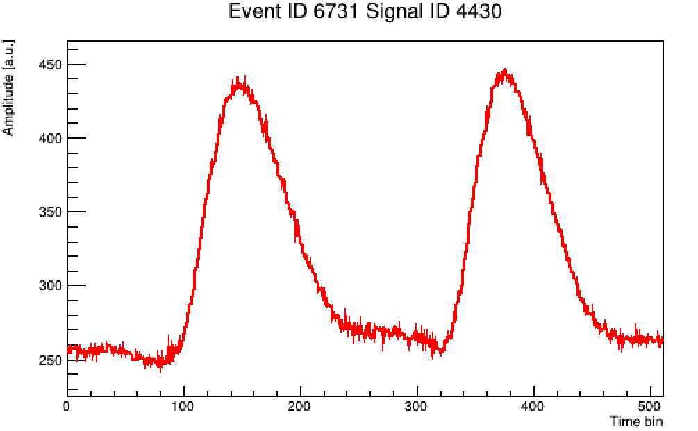

### Final exercise. Exam for getting an official REST-for-Physics certificate!

Suppose now we are going to establish a set of analysis schema for a new experiment. 
To simplify, we assume the detector only contains one readout module with one readout channel. Like an HPGe detector. The daq system triggers
at each event, and records one single waveform(TRestRawSignal) within 512 sampling window. There could be multiple pulses inside one window. 
The following figure shows an example event.

In this exercise, you will need to write your own analysis code for such detector. It should contain: 
* A new event class containing energy(s), rise time(s), triggered time(s), pulse FWHM(s) and pulse width 1/10 height(s).
* A new process to convert TRestRawSignalEvent to our new event type, and extract observables like baseline noise level, first trigger position, etc.

**Hint** You can take a look at the code of `TRestRawSignalAnalysisProcess` and `TRestRawToDetectorSignalProcess` for reference. You can also use the existing methods from `TRestRawSignalEvent` class. 

**HINT** To find multiple peaks, [`TSpectrum`](https://root.cern.ch/doc/v624/classTSpectrum.html) functionality from ROOT could be used.

The template code for this exercise can be found in the same directory. You need to first organize them into proper library directory structure, and compile them as what we do in the morning. Then, you can try to fill-in the codes of your own to complete the job!
